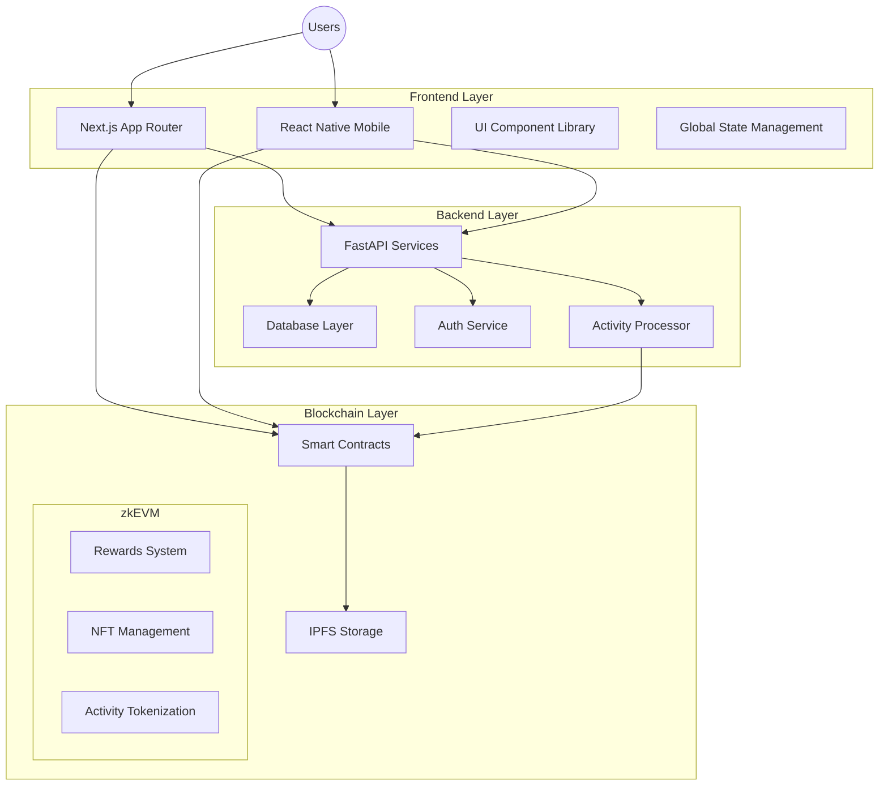

# FitApp Blockchain - Unified Architecture

## Overview

The unified FitApp Blockchain architecture follows modern best practices for Web3 fitness applications, combining the strengths of your existing projects while modernizing the technology stack.

## Core Architecture



## Technology Stack

### Frontend
- **Web**: Next.js 14+ with App Router and React Server Components
- **Mobile**: React Native with Expo
- **State Management**: TanStack Query + Zustand
- **UI**: Tailwind CSS + Shadcn/UI components
- **Web3 Integration**: viem, wagmi, rainbowkit

### Backend
- **API**: FastAPI (Python)
- **Database**: PostgreSQL with Prisma ORM
- **Authentication**: OAuth2 + JWT with wallet connection
- **Activity Processing**: Python data processing pipeline

### Blockchain
- **Smart Contract Framework**: Hardhat + TypeScript
- **Testing**: Hardhat test + Foundry
- **Networks**: Polygon zkEVM (primary), Ethereum (optional)
- **Contract Standards**: ERC-721 (NFTs), ERC-20 (Tokens), ERC-1155 (multi-token)
- **Deployment**: Ignition deployment framework

### DevOps
- **CI/CD**: GitHub Actions
- **Infrastructure**: Docker + Kubernetes
- **Monitoring**: Prometheus + Grafana
- **Logging**: OpenTelemetry

## Data Flow Architecture

1. **User Activity Capture**
   - Mobile app captures fitness activity (runs, cycling, etc.)
   - Data validated and processed locally
   - Sent to backend for verification

2. **Data Processing**
   - Backend validates activity data
   - Generates proof of activity
   - Stores raw data in database

3. **Blockchain Integration**
   - Verified activities trigger smart contract calls
   - Rewards calculation based on activity metrics
   - NFT generation for significant milestones
   - Token rewards distribution

4. **User Experience**
   - Dashboard displays earnings, activities, and NFTs
   - Social features for competition and sharing
   - Marketplace for using earned tokens

## Folder Structure

```
fitapp-consolidated/
├── apps/
│   ├── web/                 # Next.js web application
│   ├── mobile/              # React Native mobile app
│   ├── api/                 # FastAPI backend services
│   └── admin/               # Admin dashboard
├── packages/
│   ├── ui/                  # Shared UI components
│   ├── contracts/           # Smart contracts
│   ├── config/              # Shared configuration
│   └── utils/               # Shared utilities
├── infrastructure/
│   ├── docker/              # Docker configuration
│   └── kubernetes/          # Kubernetes configuration
├── scripts/                 # Development and deployment scripts
└── docs/                    # Project documentation
```

## Migration Strategy

1. **Phase 1: Core Infrastructure Setup**
   - Establish monorepo structure
   - Set up shared configurations
   - Create deployment pipelines

2. **Phase 2: Smart Contract Consolidation**
   - Audit existing contracts
   - Redesign and optimize contracts
   - Implement comprehensive testing

3. **Phase 3: Backend Consolidation**
   - Implement FastAPI services
   - Migrate data processing logic
   - Set up database with migrations

4. **Phase 4: Frontend Implementation**
   - Develop Next.js web application
   - Build React Native mobile app
   - Ensure cross-platform consistency

5. **Phase 5: Integration and Testing**
   - End-to-end testing
   - Security audits
   - Performance optimization