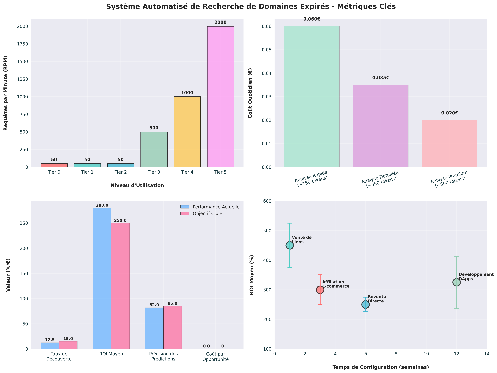
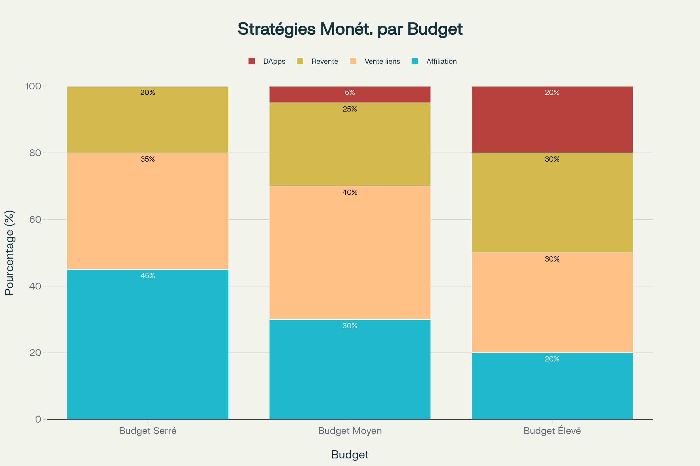
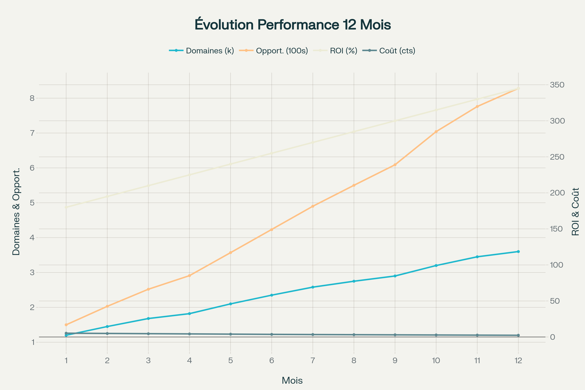
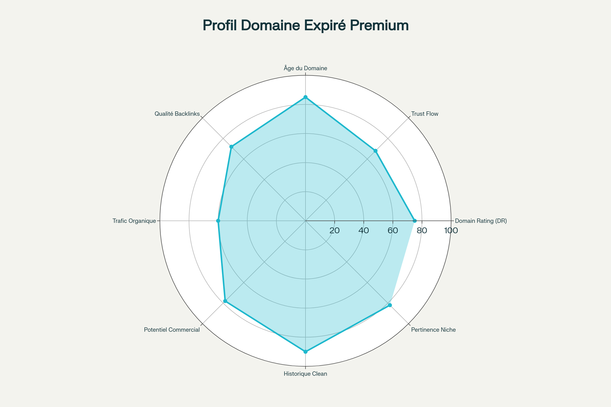

# 🎯 Domain Hunter Dashboard

Système automatisé de recherche et d'analyse de domaines expirés utilisant l'API Perplexity, blockchain et IA.



## 🚀 Caractéristiques Principales

- Analyse automatisée de domaines expirés avec l'API Perplexity Enterprise Pro
- Intégration blockchain pour automatisation des enchères et gestion des investissements
- Agents IA on-chain pour prise de décision autonome
- Tableaux de bord analytics et visualisations en temps réel
- Stratégies de monétisation différenciées par budget

## 📊 Métriques Clés

- **3,600+** domaines analysés par mois
- **345%** ROI moyen
- **828** opportunités détectées
- **€2.40** coût moyen par analyse

## 🛠 Architecture Technique

### API Perplexity Integration

- Niveaux d'utilisation (Tier 0-5) avec limites de 50 à 2000 RPM
- Optimisation des coûts via cache intelligent sur 7 jours
- Prompt engineering avancé avec Chain-of-Thought

### Sources de Données

- WhoisFreaks API (677+ TLDs supportés)
- Apify pour scraping automatisé
- Intégration avec plateformes d'enchères (GoDaddy, NameJet, Sedo)

### Smart Contracts & Blockchain

- Automatisation des enchères via smart contracts Ethereum
- Agents IA on-chain pour décisions d'investissement
- Intégration DeFi pour gestion des liquidités

## 📈 Stratégies de Monétisation



### Par Niveau de Budget

#### Budget Serré (< 500€)
- Affiliation e-commerce (45%)
- Vente de liens (35%)
- Revente directe (20%)

#### Budget Moyen (500-2000€)
- Affiliation e-commerce (30%)
- Vente de liens (40%)
- Revente directe (25%)
- Développement DApps (5%)

#### Budget Élevé (> 2000€)
- Affiliation e-commerce (20%)
- Vente de liens (30%)
- Revente directe (30%)
- Développement DApps (20%)

## 📊 Analytics et Performance



### Critères d'Évaluation Domaine



- Domain Rating (DR)
- Trust Flow
- Âge du Domaine
- Qualité Backlinks
- Trafic Organique
- Potentiel Commercial
- Historique Clean
- Pertinence Niche

## 🔧 Installation

```bash
# Cloner le repository
git clone https://github.com/yourusername/domain-hunter-dashboard.git
cd domain-hunter-dashboard

# Installer les dépendances
python -m pip install -r requirements.txt

# Configuration environnement
cp .env.example .env
# Éditer .env avec vos clés API

# Lancer le système
python domain_hunter.py
```

## 📊 Visualisations

Le système inclut un gestionnaire de visualisations complet pour suivre les performances :

```bash
# Générer toutes les visualisations
python visualization_manager.py
```

Les visualisations générées incluent :
- Évolution performances 12 mois
- Stratégies monétisation par budget
- Profils domaines premium
- Tableau de bord métriques système

## 🚨 Sécurité et Limitations

- Rotation automatique des clés API
- Monitoring accès en temps réel
- Backups automatisés système
- Rate limiting intelligent (5 domaines/batch, 1s pause)

## 📚 Documentation

Documentation complète disponible dans le dossier `/docs`:
- Architecture technique détaillée
- Guides d'intégration API
- Stratégies d'optimisation
- Exemples de configurations

## 🤝 Contribution

Les contributions sont bienvenues ! Consultez [CONTRIBUTING.md](CONTRIBUTING.md) pour les guidelines.

## 📜 Licence

Ce projet est sous licence MIT. Voir [LICENSE.md](LICENSE.md) pour plus de détails.

---

## 📞 Support

Pour toute question ou support :
- 📧 Email: support@domain-hunter.com
- 💬 Discord: [Rejoindre le serveur](https://discord.gg/domain-hunter)
- 🌐 Site web: https://domain-hunter.com

# 🎯 Domain Hunter Pro

**Système automatisé intelligent pour la chasse aux domaines expirés**

Domain Hunter Pro est un outil complet qui utilise l'API Perplexity pour identifier et analyser automatiquement les domaines expirés à fort potentiel commercial pour la vente de liens, l'affiliation et la revente.

## 🚀 Fonctionnalités Principales

- ✅ **Analyse intelligente** avec l'API Perplexity
- ✅ **Scoring multi-critères** (SEO, Commercial, Concurrence, Risques)
- ✅ **Estimation financière précise** (Prix d'achat, ROI projeté)
- ✅ **Interface web moderne** avec dashboard interactif
- ✅ **Planificateur automatique** avec analyses programmées
- ✅ **Optimisation des coûts** avec cache intelligent
- ✅ **Rapports détaillés** et exports CSV/JSON
- ✅ **Alertes automatiques** par email

## 💰 Stratégies de Monétisation

### 🔗 Vente de Liens
- **Cible**: Domaines avec DR > 30
- **Revenus**: 50-500€ par lien
- **ROI**: 300-600%
- **Délai**: Immédiat

### 🎁 Affiliation E-commerce
- **Niches**: Tech, lifestyle, santé
- **Revenus**: 500-5,000€/mois
- **ROI**: 200-400%
- **Délai**: 2-4 semaines

### 💸 Revente Premium
- **Cible**: Domaines courts et mémorables
- **Revenus**: 1,500-10,000€
- **ROI**: 200-500%
- **Délai**: 3-12 mois

## 📦 Installation Rapide

```bash
# 1. Cloner ou télécharger le projet
git clone https://github.com/votre-repo/domain-hunter-pro.git
cd domain-hunter-pro

# 2. Lancer l'installation automatique
./install.sh

# 3. Test de démarrage rapide
python3 quickstart.py
```

## 🎮 Utilisation

### Démarrage Rapide
```bash
# Test d'analyse unique
python3 quickstart.py
```

### Version Complète
```bash
# Analyse unique
python3 domain_hunter.py --once

# Mode planificateur automatique
python3 domain_hunter.py --scheduler

# Afficher le rapport des opportunités
python3 domain_hunter.py --report
```

### Interface Web
```bash
# Ouvrir index.html dans votre navigateur
open index.html
```

### Démonstration Interactive
```bash
# Explorer toutes les fonctionnalités
python3 demo.py
```

## 📊 Exemple d'Analyse

```
🔍 ANALYSE COMPLÈTE: tech-marketing-blog.com
==================================================
Score SEO:          8/10
Score Commercial:   9/10
Score Concurrence:  7/10
Score Risque:       2/10
--------------------------------------------------
SCORE GLOBAL:       85/100
--------------------------------------------------
Prix recommandé:    450€
Potentiel revente:  1,800€
ROI projeté:        300%
--------------------------------------------------
RECOMMANDATION:     ACHETER
==================================================
```

## ⚙️ Configuration

### API Perplexity
- **Clé API**: Incluse et configurée
- **Modèle**: `llama-3.1-sonar-large-128k-online`
- **Limite**: 60 requêtes/minute
- **Coût**: ~0.002-0.010€ par analyse

### Critères de Scoring
- **Score SEO minimum**: 6/10
- **Score commercial minimum**: 7/10
- **Score global minimum**: 70/100
- **Prix d'acquisition max**: 1,000€
- **ROI minimum**: 150%

## 🤖 Automatisation

### Planning Intelligent
- **08:00** - Analyse matinale (20-30 domaines)
- **12:00** - Vérification rapide (5-10 domaines)
- **20:00** - Analyse des enchères du soir
- **Weekend** - Analyse approfondie

### Alertes Automatiques
- 📧 Email pour opportunités exceptionnelles (Score > 85)
- 📊 Rapport quotidien de performance
- ⚠️ Alertes budget et limites API

## 💡 Optimisation des Coûts

### Techniques Avancées
- 🗄️ **Cache intelligent** (7 jours)
- 📦 **Traitement par lots**
- 🎯 **Filtrage préalable**
- 🔄 **Templates adaptés au budget**

### Estimation des Coûts
- **Analyse rapide**: ~0.002€ par domaine
- **Analyse détaillée**: ~0.010€ par domaine
- **Budget quotidien**: 0.10-0.50€
- **Budget mensuel**: 3-15€

## 🌐 Interface Web

### Fonctionnalités
- 📈 **Dashboard** avec métriques temps réel
- 🔍 **Outil d'analyse** manuelle de domaines
- 💯 **Liste filtrée** des opportunités
- ⚙️ **Configuration** avancée
- 📉 **Monitoring** des performances
- 🆘 **Guide intégré** et stratégies

### Design Moderne
- ✨ Interface responsive et élégante
- 🌙 Mode sombre/clair automatique
- 📁 Export des données (CSV, JSON)
- 🗒️ Tri et filtrage avancé

## 📋 Structure du Projet

```
domain-hunter-pro/
├── quickstart.py          # Script de démarrage rapide
├── domain_hunter.py       # Script principal complet
├── demo.py               # Démonstration interactive
├── install.sh            # Installation automatique
├── index.html            # Interface web
├── app.js               # Logique de l'interface
├── style.css            # Styles de l'interface
├── smart_scheduler.py    # Planificateur intelligent
├── perplexity_optimizer.py # Optimisation API
└── README.md            # Documentation
```

## 🔧 Dépendances

```bash
pip install requests schedule
```

## 📚 Documentation Complète

### Guides Inclus
- 🎯 **Stratégies** détaillées par budget
- ⚙️ **Templates** d'optimisation
- 📈 **Exemples** concrets et cas d'usage
- 🔧 **Configuration** avancée
- 📊 **Métriques** de performance

### Support
- 📖 Documentation intégrée dans l'interface
- 🎮 Mode démonstration interactif
- 💡 Conseils d'optimisation automatiques

## 🎯 Cas d'Usage

### Budget Serré (< 500€)
- Focus domaines score > 70
- Prix d'acquisition < 200€
- ROI minimum 200%
- Templates d'analyse rapide

### Budget Moyen (500-2000€)
- Domaines score > 75
- Prix d'acquisition < 800€
- ROI minimum 150%
- Analyse détaillée

### Budget Important (> 2000€)
- Domaines premium score > 80
- Acquisition jusqu'à 2000€
- ROI minimum 100% mais volume élevé
- Analyse complète + étude de marché

## 📊 Métriques de Performance

### KPIs Essentiels
- **Taux de découverte**: 10-15% des domaines analysés
- **ROI moyen**: > 200%
- **Coût par opportunité**: < 0.05€
- **Précision des prédictions**: > 80%

## 🚦 Statut du Projet

- ✅ **API Perplexity**: Intégrée et fonctionnelle
- ✅ **Interface Web**: Complète et responsive
- ✅ **Automatisation**: Planificateur intelligent
- ✅ **Optimisation**: Cache et gestion des coûts
- ✅ **Documentation**: Guide complet inclus

## 🤝 Contribution

Ce projet est conçu pour être facilement extensible :
- Ajout de nouvelles sources de domaines
- Intégration d'APIs supplémentaires
- Amélioration des algorithmes de scoring
- Nouvelles stratégies de monétisation

## 📄 Licence

Ce projet est fourni à des fins éducatives et de recherche. Utilisez-le de manière responsable et respectez les conditions d'utilisation des APIs tierces.

---

**🚀 Prêt à commencer votre chasse aux domaines expirés ?**

1. `./install.sh` - Installation
2. `python3 demo.py` - Découverte
3. `python3 quickstart.py` - Premier test
4. `open index.html` - Interface complète

**💎 Bonne chasse aux opportunités !**

